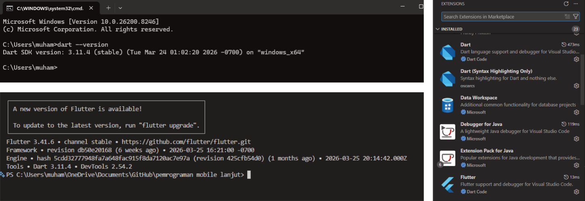
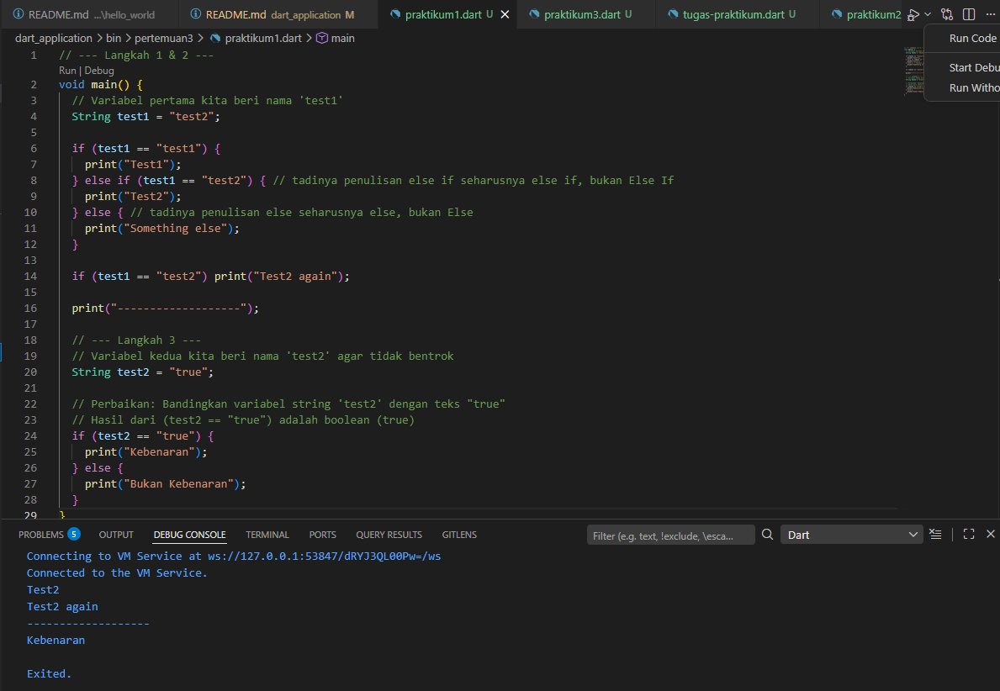
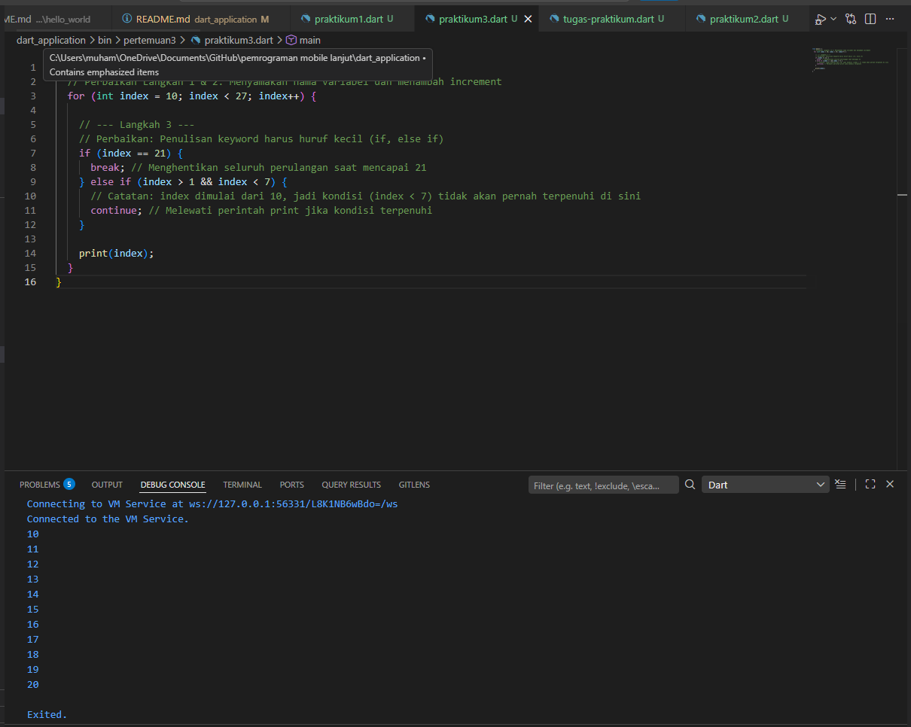
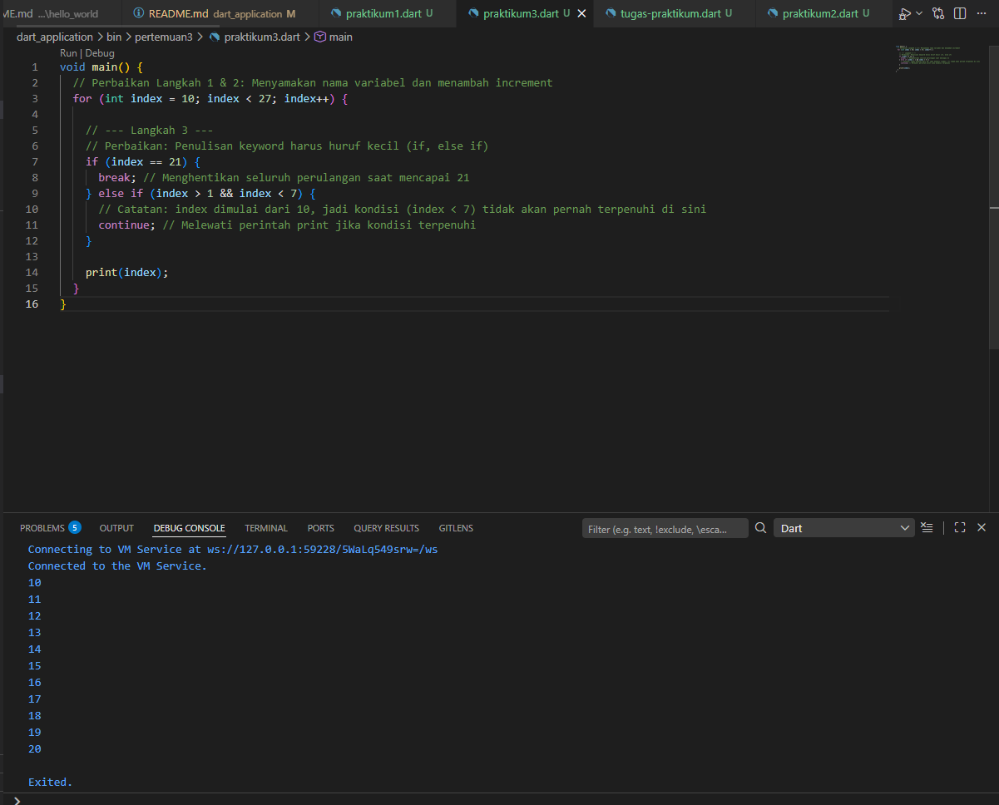
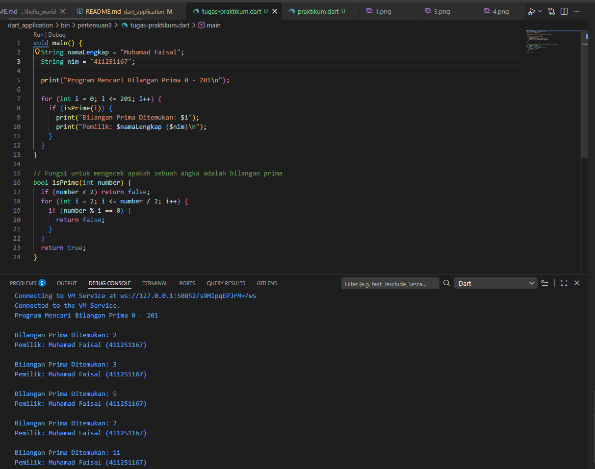
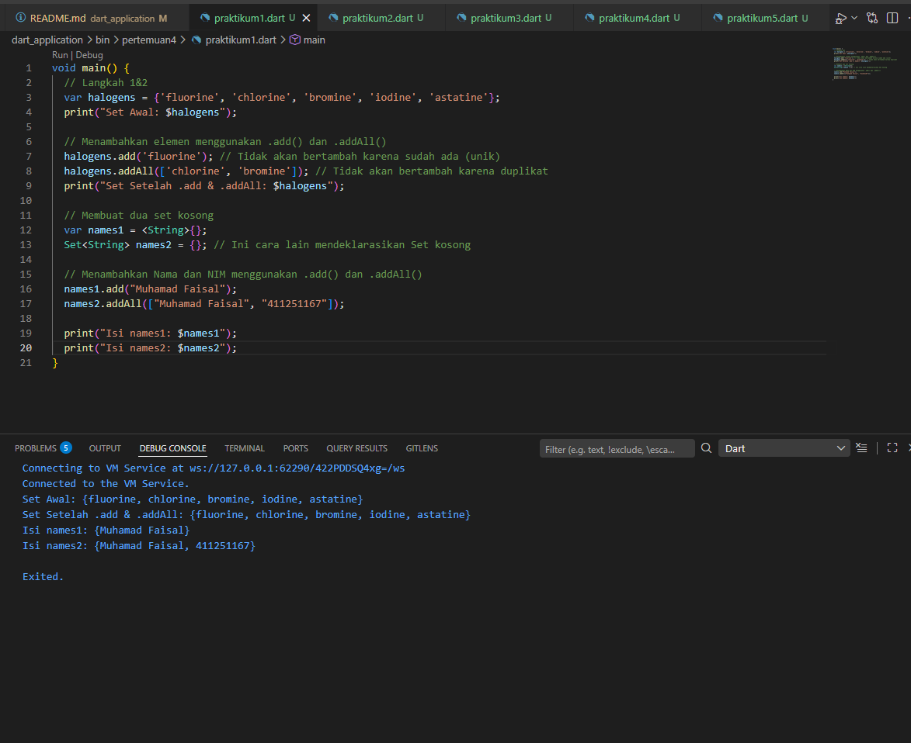
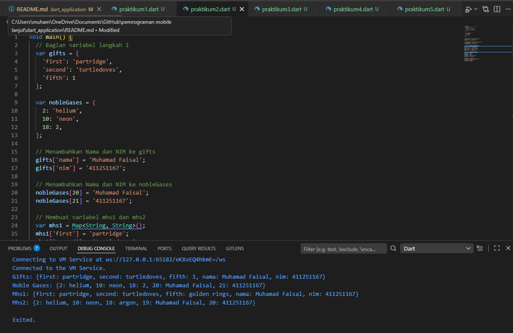
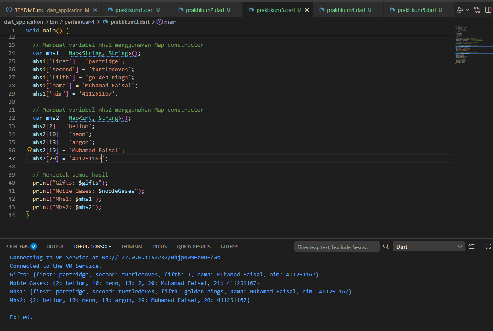
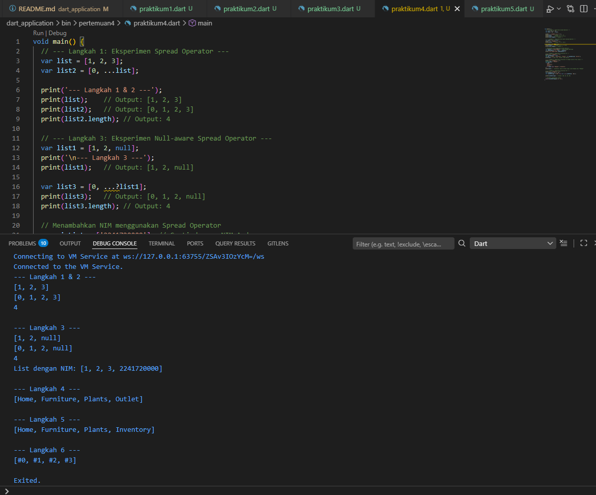
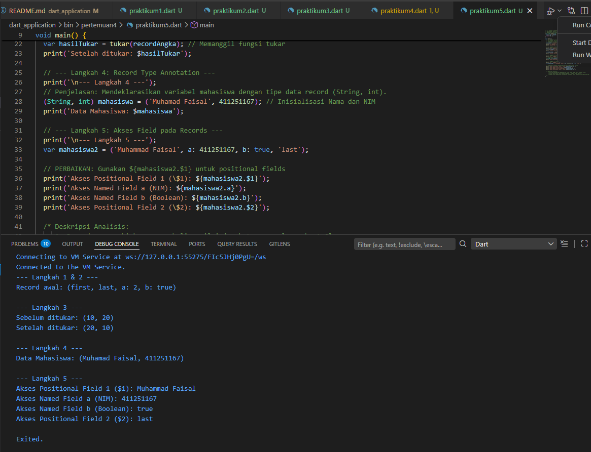

A sample command-line application providing basic argument parsing with an entrypoint in `bin/`.
**Nama:** Muhamad Faisal
**NIM** 411251167
**Program:** Pemrograman Mobile Lanjut

Pertemuan 1:
    
    
Pertemuan 2:
    Soal 2: 
        1. Flutter Ditulis Sepenuhnya dengan Dart: Framework Flutter menggunakan Dart untuk segala hal, mulai dari menyusun UI (membangun Widget) hingga menulis logika backend/business rules. Tanpa memahami sintaks dasar Dart, Anda tidak akan bisa menulis kode Flutter.

        2. Pemahaman Konsep OOP (Object-Oriented Programming): Di Flutter, "Everything is a Widget" (semuanya adalah widget). Widget ini sebenarnya adalah implementasi dari Class dan Object di Dart. Memahami konsep pewarisan (inheritance), class, dan metode di Dart sangat vital untuk menyusun UI yang baik.

        3. Manajemen Asynchronous: Aplikasi mobile sering kali harus mengambil data dari internet (API) atau membaca database lokal. Dart memiliki fitur Future, async, dan await yang harus dipahami dengan baik agar aplikasi Flutter tidak freeze (membeku) saat memuat data.

        4. Mencegah Error Runtime: Fitur terbaru Dart seperti Null Safety sangat ketat. Memahaminya di awal akan menghindarkan Anda dari aplikasi yang sering crash (berhenti paksa) di perangkat pengguna akibat nilai kosong (null).
    
     Soal 3:
        - Penggunaan Variabel & Tipe Data: Memahami kapan harus menggunakan var, final, const, serta tipe data dasar seperti String, int, dan bool. (final dan const sangat sering digunakan di Flutter untuk optimasi memori widget).

        - Control Flow (Alur Kontrol): Menguasai penggunaan if-else dan operator ternary (kondisi ? benar : salah) karena ini - sangat sering dipakai untuk merender UI secara dinamis (misal: jika loading tampilkan spinner, jika selesai tampilkan data).

        - Perulangan (Loops): Menggunakan for atau metode mapping (seperti .map()) untuk mengubah sekumpulan data (List) menjadi deretan Widget di layar (misal: membuat daftar/list kontak).

        - Keamanan Kode (Null Safety): Memastikan variabel dideklarasikan dengan benar untuk menghindari error Null Pointer Exception.

    Soal 4:
        -Null Safety adalah fitur bawaan Dart yang menjamin sebuah variabel tidak bisa berisi nilai kosong (null) secara tidak sengaja. Jika sebuah variabel memang diperbolehkan bernilai null, kita harus memberitahukannya secara eksplisit dengan menambahkan tanda tanya (?) pada tipe datanya.

        - Keyword late digunakan ketika kita ingin mendeklarasikan variabel non-nullable (tidak boleh null), tetapi kita belum tahu atau belum ingin mengisi nilainya saat itu juga. Kita berjanji kepada Dart bahwa variabel tersebut pasti akan diisi nilainya nanti sebelum digunakan/dipanggil. Jika kita memanggilnya sebelum diisi, program akan crash.
        
Pertemuan 3:
    
    
    
    

Pertemuan 4:
    Soal 1:
        
        
        
        
        
    Soal 2: 
        Functions adalah blok kode terorganisir yang digunakan untuk melakukan tindakan tertentu secara berulang. Di Dart, function adalah objek, yang berarti function dapat ditetapkan ke variabel atau diteruskan sebagai argumen ke function lain. Function membantu membuat kode lebih modular dan mudah dibaca.
    
    Soal 3:
        - Positional Parameters: Parameter yang wajib diisi sesuai urutan.
            void sapa(String nama, int umur) {
            print('Halo $nama, umur Anda $umur');
            }
        - Named Parameters: Parameter yang ditulis di dalam kurung kurawal {}. Penggunaannya lebih fleksibel karena urutannya bisa diacak dan lebih jelas dibaca.
            void setPengaturan({String? tema, bool? notifikasi}) {
            print('Tema: $tema');
            }
        - Optional Parameters: Bisa dibuat dengan kurung siku [] untuk positional, atau memberikan nilai default pada named parameters.

    Soal 4:
        Artinya, function di Dart diperlakukan sama seperti tipe data lainnya (String, int, dll.).
            void printElemen(int elemen) => print(elemen);

            var list = [1, 2, 3];
            // Melewatkan function printElemen sebagai argumen ke function forEach
            list.forEach(printElemen);
    Soal 5:
        Anonymous Function (juga disebut lambda atau closure) adalah function yang tidak memiliki nama. Sering digunakan untuk tugas singkat seperti memproses list.
            var list = ['Apel', 'Pisang', 'Jeruk'];
            list.forEach((item) {
            print('Buah: $item');
            });
    Soal 6:
        Lexical Scope: Penentuan lingkup variabel berdasarkan lokasi fisik kode tersebut ditulis. Variabel di dalam blok {} hanya bisa diakses di dalam blok tersebut atau blok di dalamnya.

        Lexical Closures: Sebuah objek function yang dapat mengakses variabel di lingkup asalnya (lexical scope) bahkan ketika function tersebut dipanggil di luar lingkup asalnya.
            Function buatPenambah(int tambah) {
                return (int i) => tambah + i; // Closure menangkap variabel 'tambah'
            }
    Soal 7:
        Di Dart versi 3.0 ke atas, cara terbaik untuk mengembalikan banyak nilai adalah menggunakan Records (seperti yang kita pelajari di Praktikum 5).
            (String, int) getBiodata() {
                return ('Faisal', 411251167);
            }