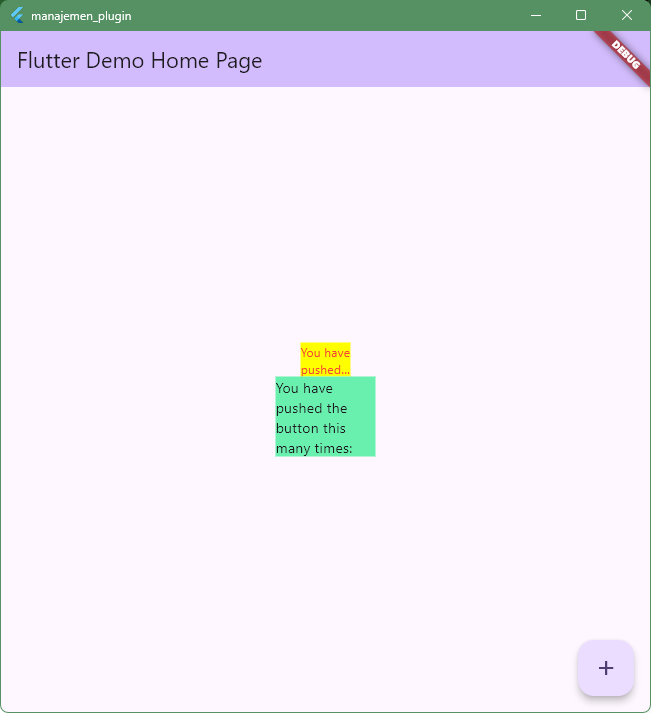

# manajemen_plugin

A new Flutter project.

## Getting Started

This project is a starting point for a Flutter application.

A few resources to get you started if this is your first Flutter project:

- [Learn Flutter](https://docs.flutter.dev/get-started/learn-flutter)
- [Write your first Flutter app](https://docs.flutter.dev/get-started/codelab)
- [Flutter learning resources](https://docs.flutter.dev/reference/learning-resources)

For help getting started with Flutter development, view the
[online documentation](https://docs.flutter.dev/), which offers tutorials,
samples, guidance on mobile development, and a full API reference.

**Nama:** Muhamad Faisal
**NIM** 411251167
**Program:** Pemrograman Mobile Lanjut

(Soal1) Praktikum 1: Praktikum Menerapkan Plugin di Project Flutter

(Soal2) Penjelasan Langkah 2:
1. Keuntungan Menggunakan Plugin (Advantages)
Penggunaan Ulang Kode (Code Reuse): Menghemat waktu pengembangan karena Anda tidak perlu membuat fitur dari nol. Selain itu, menggunakan kode yang sudah ada mengurangi risiko munculnya bug baru dibandingkan jika menulis kode sendiri.

Diuji oleh Banyak Pengguna (Many Eyes): Plugin yang populer digunakan oleh ribuan developer, sehingga kodenya menjadi sangat stabil, kaya fitur, dan telah teruji di berbagai jenis perangkat dengan ukuran layar yang berbeda-beda.

Integrasi Tingkat Rendah (Low-level Integration): Memudahkan aplikasi untuk mengakses fitur asli sistem operasi (seperti kamera, kalender, GPS di Android/iOS) tanpa mengharuskan developer Flutter menguasai bahasa native seperti Java, Swift, atau Kotlin.

2. Kekurangan Menggunakan Plugin (Drawbacks)
Manajemen Versi (Version Management): Menggunakan banyak plugin secara bersamaan berisiko menimbulkan konflik atau ketidakcocokan (inkompatibilitas) versi antara satu plugin dengan plugin lainnya.

Sulit Mendiagnosis Bug (Difficult to Diagnose Bugs): Jika terjadi error atau masalah di dalam plugin, proses pelacakan dan perbaikannya akan lebih sulit karena kode tersebut ditulis oleh orang lain.

Perubahan yang Merusak (Breaking Changes): Ketika pembuat plugin melakukan pembaruan besar (major update), fungsi-fungsi lama bisa berubah total atau dihapus, sehingga Anda terpaksa harus mengubah struktur kode aplikasi Anda agar tetap kompatibel.

3. Fungsi Perintah Utama (flutter pub)
Jika pertanyaan Anda mengenai fungsi perintah manajemen plugin, berikut jawabannya:

flutter pub add [nama_plugin]: Digunakan untuk menambahkan atau menginstal plugin baru ke dalam proyek Flutter Anda secara otomatis.

flutter pub get: Digunakan untuk mengunduh semua komponen dan dependensi plugin yang tercatat di dalam file konfigurasi pubspec.yaml ke komputer Anda.

flutter pub outdated: Digunakan untuk memeriksa apakah ada plugin di proyek Anda yang sudah usang dan memiliki versi terbaru di situs pub.dev.

flutter pub upgrade: Digunakan untuk memperbarui versi plugin ke versi terbaru yang aman sesuai batasan yang diatur di file pubspec.yaml

(Soal 3) Penjelasan Langkah 5:
Umumnya bertujuan untuk mengimpor (import) library dari plugin yang sudah diunduh ke dalam file .dart proyek (main.dart). Kode impornya seperti: import 'package:auto_size_text/auto_size_text.dart';. Selain itu, langkah ini juga menyiapkan struktur layout atau wadah (Container/Row) dengan batasan ukuran tertentu sebagai tempat uji coba widget teks.

(Soal 4) Penjelasan Langkah 6:
Pada langkah 6, saya diminta menambahkan dua widget untuk melihat perbandingannya, yaitu widget Text (bawaan Flutter) dan AutoSizeText (dari plugin).

Fungsi: Keduanya sama-sama berfungsi untuk menampilkan string teks ke layar.

Perbedaannya:
Widget Text: Menggunakan ukuran font yang statis (tetap). Jika teks lebih panjang daripada ukuran container yang membungkusnya, teks tersebut akan terpotong (clipped) atau menyebabkan tampilan menjadi error overflow (garis peringatan kuning/hitam di layar).

Widget AutoSizeText: Bekerja secara dinamis. Ia secara otomatis mengecilkan ukuran huruf (font size) menyesuaikan dengan ruang container yang tersedia, sehingga seluruh teks tetap muat dan mencegah terjadinya error overflow

(Soal 5) Penjelasan:
minFontSize: Mengatur ukuran font terkecil yang diizinkan. Teks tidak akan mengecil lebih rendah dari angka ini (defaultnya adalah 12).

maxFontSize: Mengatur ukuran font terbesar yang diizinkan saat teks menyesuaikan ruang yang luas.

stepGranularity: Menentukan tingkat atau skala penurunan ukuran teks (misalnya, jika diisi 2, maka ukuran font akan diturunkan per 2 poin hingga muat).

presetFontSizes: Berisi daftar (array) ukuran font tertentu yang sudah ditetapkan. Widget hanya akan memilih ukuran yang ada di daftar ini secara berurutan hingga teksnya muat.

group: Digunakan untuk mengelompokkan beberapa widget AutoSizeText agar ukuran hurufnya otomatis mengecil secara seragam (sama besar).

overflowReplacement: Widget alternatif (seperti widget pengganti) yang akan ditampilkan jika teks tetap tidak muat di layar meskipun ukurannya sudah diturunkan sampai batas minFontSize.

wrapWords: Menentukan apakah kata yang terlalu panjang boleh dipotong/diputus (break) agar muat ke baris berikutnya (defaultnya adalah true).

maxLines: Membatasi jumlah baris maksimal yang boleh digunakan untuk menampilkan teks.

style: Mengatur gaya teks dasar seperti jenis huruf (font family), warna, dan ketebalan (font weight).

textAlign: Mengatur posisi perataan teks (seperti rata kiri, rata kanan, atau tengah).